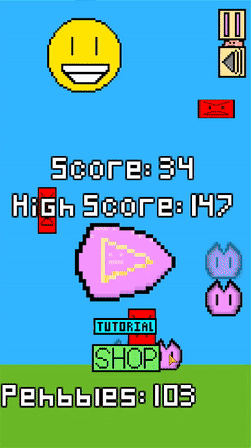

# Peh | Mobile Arcade Game

Code avaiable upon request.

[Play Store - Peh](https://play.google.com/store/apps/details?id=com.charizard832.game)

Peh is a cross-platform mobile arcade game for both IOS and Android built in Java using libGdx. Players avoid falling Pehnemies to reach the highest scores they can. Players can collect falling Sunpehs to gain extra lives, and collect falling Pehbbles to purchase skins and upgrades in the shop.

## Features
 - [Movement System](#movement-system)
   - Simple tap-to-move
   - Fadepeh system
 - [Pehnemies](#pehnemies)
   - Follow Pehnemy
   - Random Pehnemies
 - [Sunpehs](#sunpehs)
   - Additional lives
 - [Pehbbles](#pehbbles) 
   - In-game currency
 - [Shop system](#shop-system)
   - Skins
   - Upgrades
 - [Tutorial](#tutorial)
 - Original art and music

#### Movement System 

Peh features a simple movement system. The player's Peh changes direction upon every tap. Additionally, there is a system called Fadepeh that allows the user to save and teleport to a location while playing. There are two buttons located on the side of the screen- the top one to set the Fadepeh for the teleport location, and the bottom one to teleport to the Fadepeh.

#### Pehnemies
There are three types of falling Pehnemies the player has to avoid. The first one "follows" the player by reappearing at the current horizontal location of the player's Peh. The other two, which are slightly different shapes from the follow Pehnemy, reappear at random locations. Each type of Pehnemy has a speed scaling system, where they increase in speed everytime they give the player a point.

#### Sunpehs
Players can collect Sunpehs for additional lives while in game. Every 15 points, there is a chance that the Sunpehs fall for the player to collect. There is initially one Sunpeh, and another spawns at 50 points.

#### Pehbbles
Players can collect Pehbbles to use at the shop to purchase skins and upgrades. Similar to the Pehnemies, Pehbbles also have a speed scaling system. A total of 5 Pehbbles get spawned spread across different point thresholds.

#### Shop System

Peh features a shop system for players to buy upgrades and skins for their Peh using their collected Pehbbles. There are four skins for the player to buy, and they can switch between them as they like. There are three different kinds of upgrades. The first one increases the number of starting lives. The second one increases the number of lives the Sunpehs give. The third increases the number of Pehbbles given upon collecting a Pehbble. Each have their own cost curves and max number of upgrades. There is also a button that allows the player to watch a video ad to gain 25 Pehbbles.

#### Tutorial

There is a tutorial system to help new Peh players become familiar with Peh's objective and movement system. Players can access the tutorial at anytime from the main title screen and game-over screen. It explains each portion of the game with a quick and interactive demo.

#### Original Art and Music
Peh features original art created using Paint.net and original music composed in MuseScore. Peh uses a spritesheet to save device memory.

There are two music tracks included in Peh- the gameplay music and gameover music. Both tracks can be found in the assets folder on [this GitHub page](https://github.com/zacharylinorman/Peh).

## Privacy Policy
This app does not collect any data.
